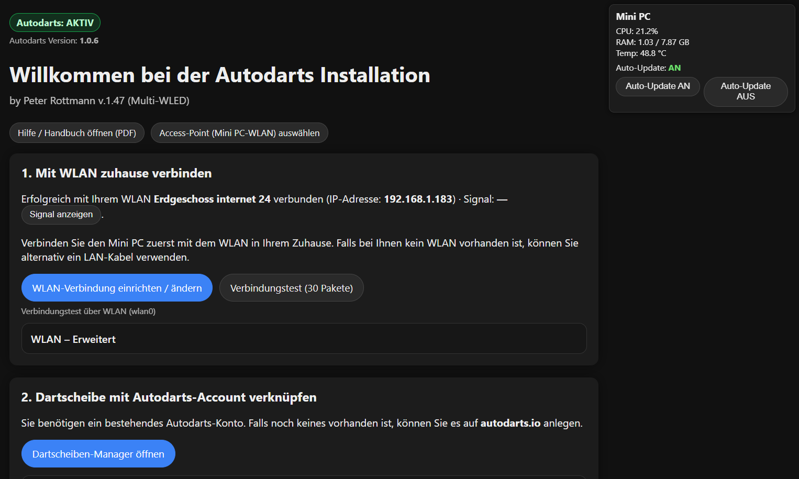
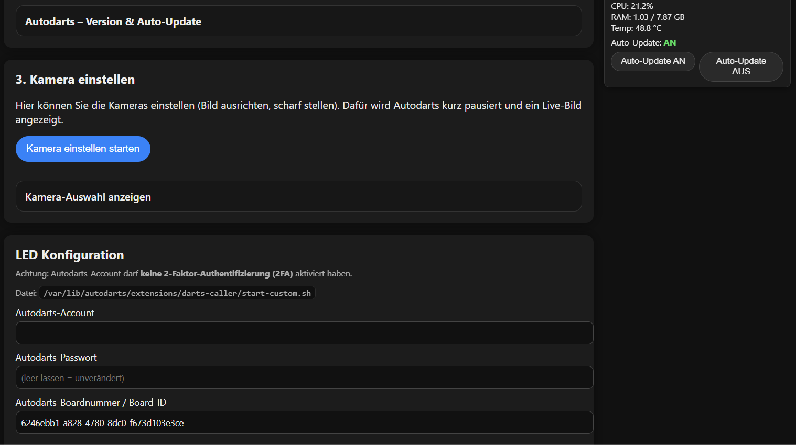
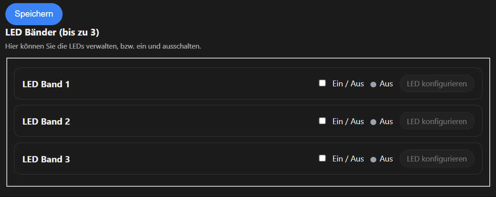
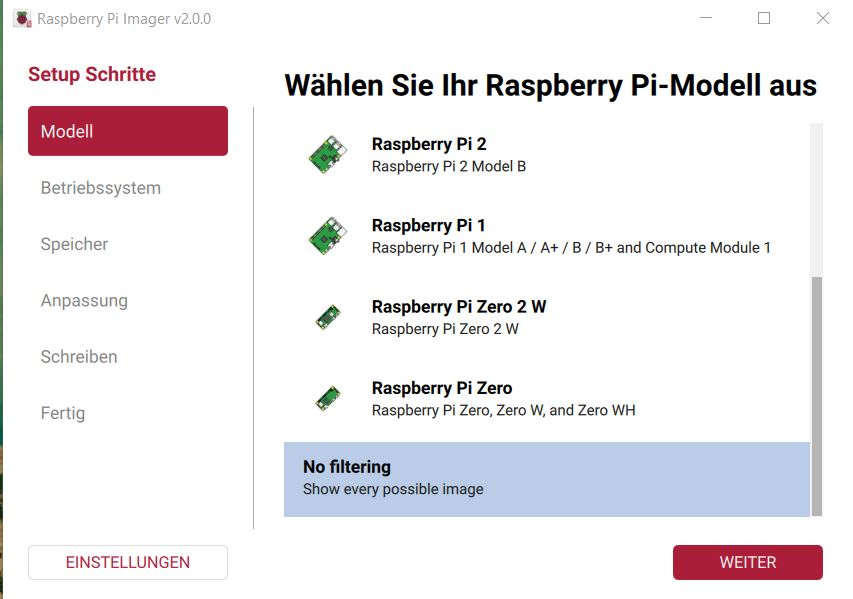
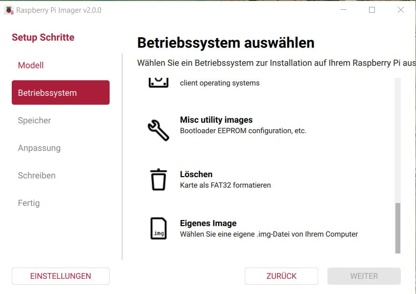
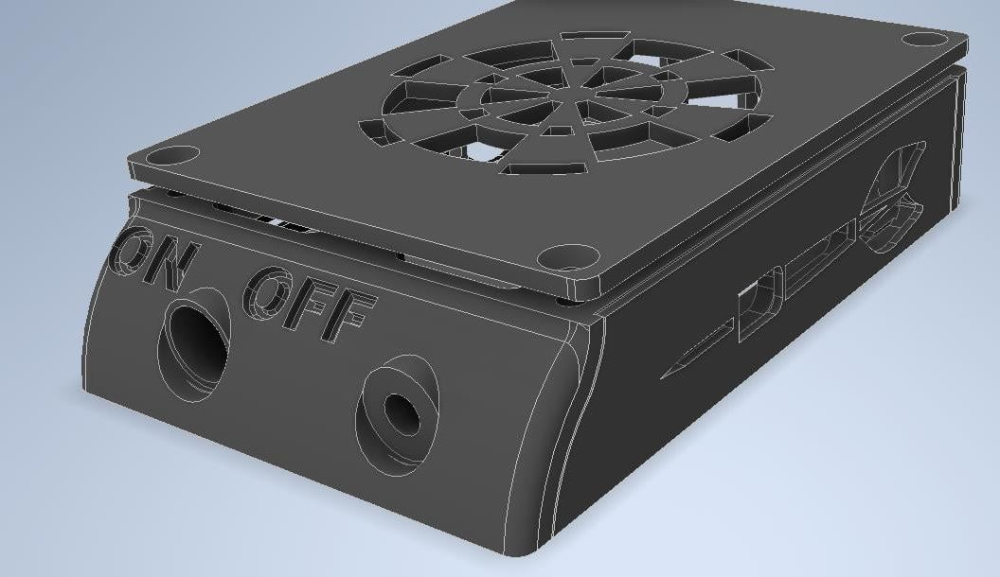
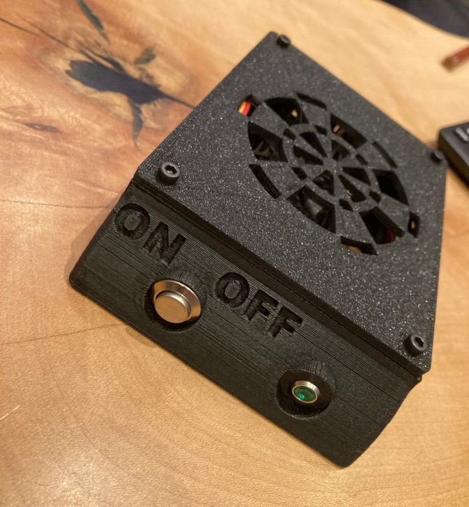
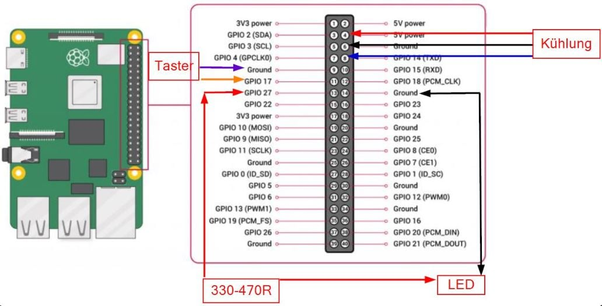
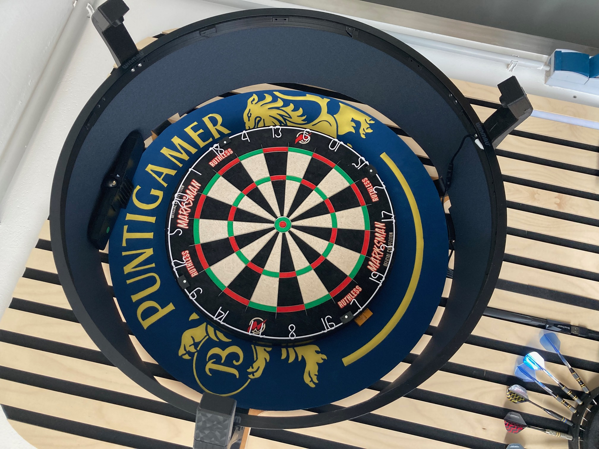

  <a href="README.md">🇩🇪 Deutsch</a> | 🇬🇧 English

<h1 align="center">Autodarts Raspberry Images</h1>

  

<h2 align="center">
  <a href="https://youtu.be/vZOtYZ-dGQs">Watch preview video</a>
</h2>

  Prepared Raspberry Pi images for <strong>Autodarts</strong> on <strong>Raspberry Pi 4</strong> and <strong>Raspberry Pi 5</strong>.

  
  
  
  

  
  
  

  <em>Click the preview image to watch the video.</em>

---

## 🇬🇧 English

### Description

This project provides two preconfigured images for **Raspberry Pi 4** and **Raspberry Pi 5**, specially optimized for use with **Autodarts**.

**ADDITIONAL NOTE: Please update the web panel as soon as possible whenever a new version is available so you always have the latest features.**

- **Raspberry Pi 4**: Headless installation including QR codes
 **[download_LINK](https://autodarts-pi4-download.peter-2b8.workers.dev/download)**
  
- **Raspberry Pi 5**: Full installation with graphical user interface including QR codes  
  Autodarts starts automatically when the system boots, so the setup is ready to use immediately.
  **[download_LINK](https://autodarts-pi5-download.peter-2b8.workers.dev/download)**

---

# 🚧 Download currently unavailable

**The download link is currently disabled due to a major update.**

## Available again from **29.03.**

---

**Installation** --> Select `Use custom image`

  
  

[Video_Installation_1](https://youtu.be/MPp4fZqoqj4)  
[Video_Installation_2](https://youtu.be/VT4V8c9nuxs)

---

### Supported systems

#### Raspberry Pi 4 – Headless installation

The Raspberry Pi 4 version is designed as a **headless system**.  
**No monitor, mouse, or keyboard** is required.

Only the following need to be connected:

- the cameras
- optionally a LAN cable
- or a compatible Wi-Fi stick

Since the Raspberry Pi 4 runs without a graphical interface, it is operated from an external device, for example:

- tablet
- notebook
- PC
- smartphone

#### Raspberry Pi 5 – Full installation

The Raspberry Pi 5 version is designed as a **full installation with graphical user interface**.

Required hardware:

- monitor
- mouse
- keyboard
- Wi-Fi dongle or LAN cable

After startup, Autodarts opens automatically in the browser.

---

### Hardware requirements

#### Raspberry Pi 4

- at least **2 GB RAM**
- **active cooling required**

**Note:**  
The Raspberry Pi 4 is not powerful enough for this use case to provide a smooth graphical user interface permanently. For that reason, this version is intentionally designed as a headless setup.

#### Raspberry Pi 5

- at least **4 GB RAM**
- **active cooling required**

---

### Network and initial configuration

When the Raspberry Pi starts, an **access point** is automatically created.

**Default credentials**

- **Wi-Fi name:** `Autodartsinstall1`
- **Password:** `Autodarts1234`  
  **If you have multiple dartboards, the access point can be renamed.**

After connecting to this Wi-Fi, the web interface can be accessed in the browser at:

`http://10.77.0.1`

**IMPORTANT:** Only connect to the access point for configuration, not for playing. For playing, switch back to your normal home/internet Wi-Fi.

Optionally, you can scan **QR_Code_1** to connect and **QR_Code_2** to open the web interface.  
The QR code layout is designed so it can be printed and attached to the camera arm. See the download link.

  

The image is designed to be printed as a photo (10x15 cm)  
(for example at Bipa, dm, or other stores with photo printing).  
If the access point name is changed, different QR codes can also be generated and printed.

Changing the access point name is only necessary if multiple dartboards (Raspberry Pis) are used in the same room.

[Link to the QR codes](https://github.com/Jumbo125/Autodarts-Webinterface-Installation/releases/download/V1/QR_Codes.zip)

---

### Connection to your home network

If the Raspberry Pi should be connected to your home Wi-Fi or the internet via Wi-Fi, an **external Wi-Fi antenna or USB Wi-Fi stick** is required.

The internal Wi-Fi chip of the Raspberry Pi is already used for the access point.  
If you use a **LAN cable**, no additional Wi-Fi stick is needed.

**Recommended Wi-Fi dongles**

1. **BrosTrend AC650 Linux USB Wi-Fi Stick**
2. **AR9271 NetCard**  
   _(cheaper, but lower-quality alternative)_

What matters most is not maximum speed, but rather:

- stable connection
- low latency
- low jitter
- no connection dropouts

---

### Optional hardware: LED and switch

The system is prepared to optionally integrate an **LED** and a **switch / button**.

  
  
  

[Link to the 3D print files](https://www.thingiverse.com/thing:7315470)

**IMPORTANT INFORMATION:** Please do not install the Thinkreverse script. All of those scripts are already included in these images.

#### Safe shutdown

If the switch is pressed for more than **4 seconds**, the LED starts blinking quickly and the Raspberry Pi performs a **safe shutdown**.

This helps protect the system and the SD card.

#### Restarting the Autodarts board manager

If the switch is pressed for about **3 seconds**, the **Autodarts board manager** is restarted.

This is especially helpful if during gameplay:

- the system becomes sluggish
- darts are detected with delay
- hits are not detected reliably

In such cases, restarting the board manager is often enough without having to reboot the entire system.

---

### Web interface features

The web interface provides numerous functions for setup, diagnostics, and operation of the system.

**General features**

- easy connection to a Wi-Fi network
- checking Wi-Fi/LAN connection for stability, packet loss, and speed
- direct access to the dartboard manager, even if it is not yet linked to an Autodarts account
- switching between different versions
- focusing and sharpening each individual camera in fullscreen mode for better accuracy
- and much more

---

**WLED support**

- **WLED is preinstalled**
- **Darts-Hub is currently not installed; it is not required**
- up to **3 WLED controllers** can be used with the system at the same time
- direct access to WLED lighting effects through the web interface

If WLED is used, a closed case is recommended.  
For the Winmau Plasma Light Ring, I have created a low-cost solution for this.

The download link for the WLED settings will follow soon.

  

[Link to the 3D print files](https://www.thingiverse.com/thing:7315431)

**Darts-Hub**  
(What is Darts-Hub?)

- Simply put, Darts-Hub is a powerful and very well-designed graphical interface that is used, among other things, to control various other programs.
- To control LED effects, the `darts-caller` and `darts-wled` services are required. Both are systems from the same developer.
- Configuring them requires some IT knowledge.
- To make this easier, Darts-Hub provides a user interface for controlling these systems.
- However, this does not work on the Raspberry Pi 4.
- To still make LED effects available there, I created a separate interface for configuring those effects.
- Anyone using a Raspberry Pi 5 setup can install Darts-Hub later. If I find the time, I may add it directly to the Raspberry Pi 5 image in the future.

---

**Admin area**

The admin area provides additional management functions:

- updating the complete web panel
- installing the **UVC Hack**
- enabling / disabling the firewall
- additional system and administration functions

---

### Third-party software used

This project uses or references third-party software and components.  
All rights remain with the respective original authors.

- **Autodarts**  
  Repository: `https://github.com/ddhille/autodarts-releases`  
  License: **MIT License**

- **Darts Caller**  
  Repository: `https://github.com/lbormann/darts-caller`  
  License: **GNU GPL v3**

- **Darts WLED**  
  Repository: `https://github.com/lbormann/darts-wled`  
  License: **GNU GPL v3**

Please note that only the respective license terms of third-party software apply to those components.

---

### Copyright and usage restrictions

**Copyright (c) 2026 Peter Rottmann**

Unless otherwise stated, the following usage restrictions apply exclusively to the parts of the project created by me.

**This project is not Open Source.**  
**No use, modification, or redistribution without explicit written permission.**

**All rights reserved.**

It is not permitted to copy this software, in whole or in part,  
modify it, redistribute it, publish it, sublicense it,  
or use it commercially without my prior written consent.

This software is provided without warranty.

---
